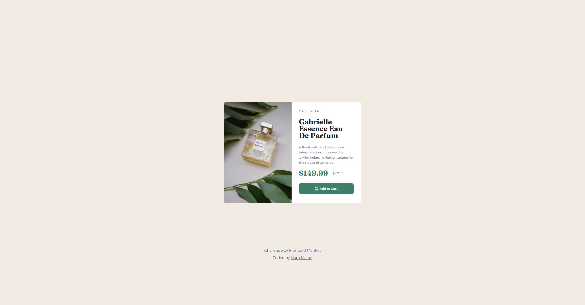
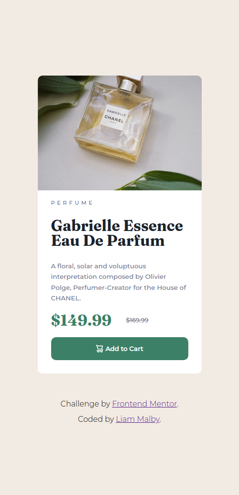

# Frontend Mentor - Product preview card component solution

This is a solution to the [Product preview card component challenge on Frontend Mentor](https://www.frontendmentor.io/challenges/product-preview-card-component-GO7UmttRfa). Frontend Mentor challenges help you improve your coding skills by building realistic projects.

## Table of contents

- [Frontend Mentor - Product preview card component solution](#frontend-mentor---product-preview-card-component-solution)
  - [Table of contents](#table-of-contents)
  - [Overview](#overview)
    - [The challenge](#the-challenge)
    - [Screenshot](#screenshot)
    - [Links](#links)
  - [My process](#my-process)
    - [Built with](#built-with)
    - [What I learned](#what-i-learned)
    - [Continued development](#continued-development)
  - [Author](#author)
  - [Acknowledgments](#acknowledgments)

## Overview

### The challenge

Users should be able to:

- View the optimal layout depending on their device's screen size
- See hover and focus states for interactive elements

### Screenshot

Desktop view

Mobile view

### Links

- [Solution URL](https://github.com/liammalby/product-preview-card-component)
- [Live Site URL](https://liammalby.github.io/product-preview-card-component/)

## My process

### Built with

- Vanilla CSS
- HTML

### What I learned

This was a valuable exercise in which I refamiliarised myself with responsive design. I also revisited my understanding of `grid`, although ultimately I used a mixture of both `grid` and `flex`.

### Continued development

This is not quite perfect. I had trouble with positioning the footer. I would like to get it to basically stay in the same position on the page, but without overlapping the main card when the view height becomes too small. I tried a variety of methods, including `position: absolute` in the CSS, however I couldn't get it to work.

## Author

- Website - [Liam Malby](https://github.com/liammalby/)
- Frontend Mentor - [@liammalby](https://www.frontendmentor.io/profile/liammalby)

## Acknowledgments

Thanks to Grace Snow, EV, and Maxime Danic for your assistance with elements of this challenge.
